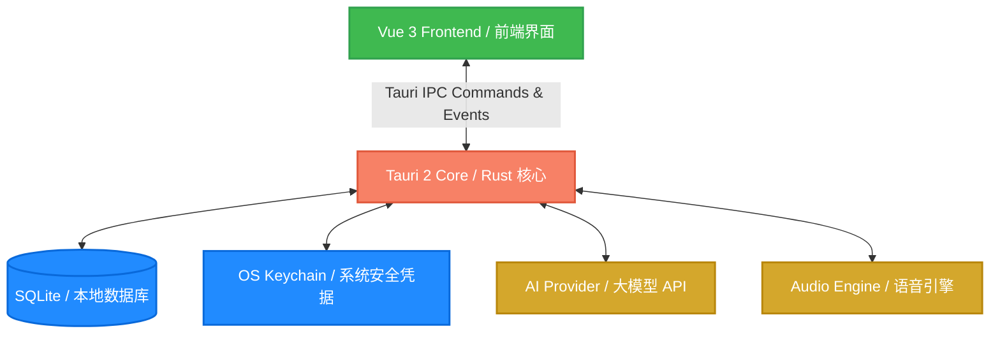

<div align="center">
  <h1>🎙️ VoxVerse 🌌</h1>
  <p><b>A Voice-First Character Universe for Immersive Roleplay and Language Learning</b></p>
  <p><b>专为沉浸式角色扮演与语言学习打造的语音优先角色宇宙</b></p>

  <p>
    
    
    
    
    
  </p>
</div>

---

### 📖 Introduction / 简介

**VoxVerse** is an interactive, voice-first desktop application designed for immersive roleplay and language practice. Powered by a high-performance **Tauri 2 + Vue 3** stack, VoxVerse connects you with rich AI characters utilizing multi-layered memory and realistic relationships. It integrates streaming text-to-speech (TTS), speech-to-text (STT), and an automated feedback system to evaluate and guide your spoken language skills.

**VoxVerse** 是一款专为沉浸式角色扮演和语言练习设计的语音优先桌面应用程序。基于高性能的 **Tauri 2 + Vue 3** 架构，VoxVerse 能够通过多层次记忆和真实的关系系统为您连接丰富的 AI 角色。它集成了流式文本转语音 (TTS)、语音转文本 (STT) 以及自动反馈系统，用于评估和指导您的语言表达能力。

---

### 🚀 Key Features / 核心特性

| Feature / 特性 | English Description | 中文说明 |
| :--- | :--- | :--- |
| **🗣️ Voice-First UX <br> 语音优先体验** | Streamlined audio pipeline supporting real-time speech-to-text (STT) and text-to-speech (TTS) with expressive UI states (recording, thinking, speaking, and errors). | 优化的语音流水线，支持实时语音转文字 (STT) 和语音合成 (TTS)，配合丰富的录音、思考、发言和错误提示等 UI 状态。 |
| **🧠 Cognitive Memory <br> 认知记忆系统** | Multi-layered memory system that tracks, visualizes, and manages long-term facts stored locally in SQLite, easily manageable via the Memory panel. | 多层级记忆系统，在本地 SQLite 中记录、可视化并管理角色的长期记忆与已知事实，可通过记忆面板轻松清理或注入。 |
| **💖 Relationship Dynamics <br> 动态人际关系** | Dynamic intimacy and trust levels, story progression phases, commitments, and user boundaries dynamically injected into AI chat prompts. | 动态计算亲密度、信任度、故事进度以及用户边界，并将这些关系上下文实时注入到大模型的 Prompt 中。 |
| **📝 Structured Feedback <br> 结构化闭环反馈** | Automatic grammar corrections, vocabulary improvements, dimensional scores (pronunciation, grammar, vocabulary), and smart reply suggestions. | 针对用户发音与语法自动进行闭环纠错、词汇润色、维度评分（发音、语法、词汇）并智能生成推荐回复。 |
| **🔒 Local-First Privacy <br> 本地优先隐私** | Conversation data and profiles stored locally. API keys secured in OS Keyring. User-controlled network and automatic correction toggles. | 所有对话和学习数据存在本地 SQLite。API 密钥加密存入系统钥匙串 (Keyring)。网络请求与自动纠错完全由用户自主配置。 |
| **💻 Developer Friendly <br> 开发者友好** | Built-in CLI tool for read-only diagnostics, session exports, and local debugging. | 内置强大的命令行工具 (CLI)，支持只读诊断、会话导出及本地调试。 |

---

### 🛠️ Architecture / 技术架构



---

### 🎯 Practice Modes / 语言实践模式

- **💬 Free Talk / 自由对话**: Spontaneous conversation to build flow and confidence. / 自由闲聊，培养语言表达流利度与自信心。
- **🎭 Roleplay / 角色扮演**: Interact with characters in custom-defined fictional contexts. / 与自定义角色在特定的虚构或现实背景中开展角色扮演。
- **💼 Scenario Drill / 场景演练**: Navigate functional scenarios (e.g., ordering food, checking in). / 针对功能性场景（如餐厅点餐、酒店入住）进行针对性实战演练。
- **📝 IELTS Speaking / 雅思口语**: Mock exams structured for IELTS speaking criteria with detailed scoring. / 模拟雅思口语考试，提供结构化问题与细致的评分标准。
- **👔 Interview Practice / 面试模拟**: Simulate job interview scenarios with immediate professional feedback. / 模拟求职面试场景，并实时获取专业度反馈。

---

### ⚡ Quick Start / 快速开始

#### 1. Setup & Installation / 安装依赖
Ensure you have [Node.js](https://nodejs.org/) and [pnpm](https://pnpm.io/) installed.
确保您本地已安装 Node.js 与 pnpm 包管理器。
```bash
pnpm install
```

#### 2. Run in Development Mode / 运行开发模式
Launch the desktop application locally.
在本地启动桌面端开发服务器。
```bash
pnpm tauri dev
```

#### 3. Test & Validate / 运行测试与验证
Run the Rust unit tests and validation suite.
运行 Rust 单元测试以及项目规范检查。
```bash
# Run Rust unit tests
cargo test --manifest-path src-tauri/Cargo.toml

# Run product validation suite
pnpm exec vue-tsc --noEmit
pnpm build
pnpm validate:v0.1
pnpm validate:lv4
```

#### 4. Native CLI / 原生命令行工具
Use the CLI to perform local diagnostics and export sessions.
使用命令行工具对系统进行诊断或导出数据。
```bash
pnpm cli -- status --json
pnpm cli -- diagnostics run --json
pnpm cli -- session export --session <id> --json
```

---

### 💻 Platform Support & Desktop Launchers / 平台支持与启动方式

#### Windows
- **Target**: Intel/AMD 64-bit (`x86_64-pc-windows-msvc`).
- **Double-click Launcher**: 
  - Double-click [LaunchVoxVerse.exe](file:///C:/AI_Coding/VoxVerse/LaunchVoxVerse.exe) to instantly run the newest compiled version of the app (release or debug build) silently.
  - Alternatively, run or inspect [LaunchVoxVerse.bat](file:///C:/AI_Coding/VoxVerse/LaunchVoxVerse.bat).
- **双击启动**:
  - 双击运行根目录下的 [LaunchVoxVerse.exe](file:///C:/AI_Coding/VoxVerse/LaunchVoxVerse.exe) 即可静默启动最新编译的调试或发布版本。
  - 也可运行或查看 [LaunchVoxVerse.bat](file:///C:/AI_Coding/VoxVerse/LaunchVoxVerse.bat)。

#### macOS Apple Silicon
1. Install development environment / 安装开发环境:
   ```bash
   brew install node pnpm
   curl --proto '=https' --tlsv1.2 -sSf https://sh.rustup.rs | sh
   ```
2. Build the macOS `.app` bundle / 构建桌面安装包:
   ```bash
   pnpm build
   pnpm tauri build
   ```
   The local `.app` bundle will be generated under `src-tauri/target/release/bundle/macos/VoxVerse.app`.
   导出的 `.app` 安装包将位于 `src-tauri/target/release/bundle/macos/VoxVerse.app`。

---

### 📂 Documentation Map / 文档指引

Refer to these files for detailed designs and specifications:
您可以查阅以下文件了解更详细的设计和规范：

- 📝 [task.md](file:///c:/AI_Coding/VoxVerse/task.md) — Authoritative roadmap and milestones / 权威的产品路线图与开发里程碑进度。
- 📐 [implementation_plan.md](file:///c:/AI_Coding/VoxVerse/implementation_plan.md) — Technical V1 design & specifications / V1 版本技术架构设计与规格说明。
- 🔍 [walkthrough.md](file:///c:/AI_Coding/VoxVerse/walkthrough.md) — Architecture and developer walkthrough / 架构概览与开发者维护指南。
- ⌨️ [native-cli.md](file:///c:/AI_Coding/VoxVerse/native-cli.md) — CLI instructions & commands / 原生 CLI 命令行工具的使用说明与诊断命令。
- 📈 [升级计划v0.6.md](file:///c:/AI_Coding/VoxVerse/升级计划v0.6.md) — Current productization scope and execution plan / 当前 v0.6 版本产品化的执行计划。

---

<div align="center">
  <sub>Built with ❤️ by the VoxVerse Team. Licensed under MIT.</sub>
</div>
