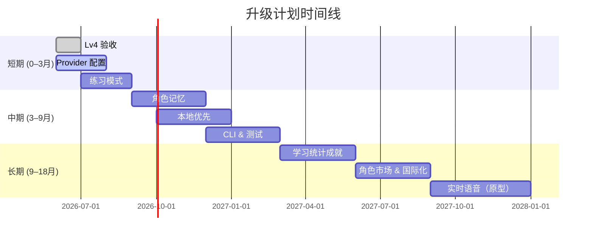
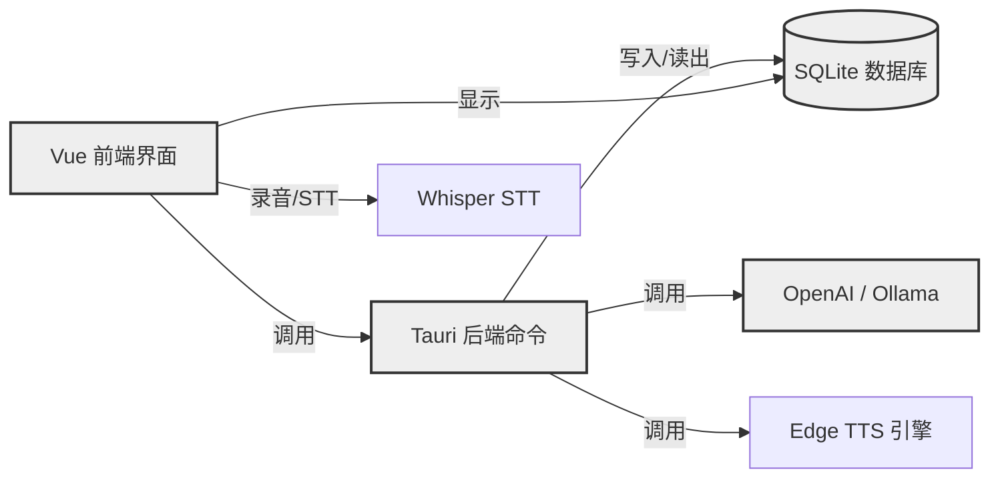

# 执行摘要

VoxVerse 项目（原名 SpeakMate）是一款基于 Tauri 2 + Vue 3 桌面应用的沉浸式语音角色扮演学习系统。当前处于 V0.1 RC 阶段，核心模块（基础会话、语音交互、角色管理、学习反馈）已实现。系统采用前端 Vue 组件与后端 Rust（Tauri IPC）协作，使用 SQLite 存储会话、角色、记忆等多层数据。项目功能包括**实时对话、可定义角色、可插拔音频引擎、记忆与关系面板**。依赖 OpenAI 兼容接口（GPT 聊天）、Whisper STT、Edge TTS，以及 Ollama 等 AI 提供者。部署方式为 Tauri 打包生成跨平台应用（已生成 Windows 安装包并通过基础测试）。测试覆盖包括 Rust 单元/集成测试及前端构建验证。目前**CI/CD**尚不完善，主要靠本地 `pnpm validate` 脚本和手动发布。版本历史记录散见于 `task.md` 和构建日志文档。

**假设与待补充信息**：生产环境规模、并发用户数、SLA 等未指定。我们假设面向教育用户（个人/机构），对稳定性和数据隐私要求较高。部署主要在 Windows/macOS 桌面环境，网络连接可靠性一般。有关性能需求（延迟、吞吐）和安全合规（如隐私、GDPR）尚未明示，本报告按未知项标注“未指定”。

## 1. 当前系统概述

- **架构与功能模块**：系统采用 Tauri 框架分层设计，前端使用 Vue 3 构建交互式 UI（`App.vue`、`MessageInput.vue`、`SessionHistory.vue` 等），通过 Tauri IPC 与 Rust 后端通信。后端以 Rust 实现，对话会话协调器和 CLI（位于 `src-tauri/src/bin/voxverse.rs`）处理业务逻辑，包括消息发送、角色管理、场景练习等。系统核心功能分布为：  
  - **对话引擎**：支持流式聊天（OpenAI GPT 类接口）与角色扮演，利用 `send_message` Tauri 命令实现前后端联动流式输出。  
  - **语音交互**：集成 Whisper（或 Web 语音 API）进行语音转文本（STT），使用 Edge TTS（或浏览器 TTS）进行文本转语音。前端 `MediaRecorder` 录音与后端 STT 调用链路已就绪。  
  - **角色管理**：SQLite `characters` 表持久化角色信息（姓名、语言、个性等），提供增删改查操作和导入/导出功能；前端通过组合式钩子 `useCharacter.ts` 与 `SideBar.vue`、`CharacterModal.vue` 实现角色切换和编辑。  
  - **会话与学习反馈**：数据库模型包括 `chat_sessions`、`messages`、`vocabulary`、`corrections`、`scenarios` 等。前端展示会话历史（`SessionHistory.vue`）、差异视图（`DiffView.vue`）、反馈面板（`FeedbackPanel.vue`），并根据对话生成场景练习、生词本和学习报告。  
  - **多层记忆与关系**：实现“四层记忆”架构，长期事实、密切度/信任度状态通过 SQLite 保存，工具调用日志记录会话细节。前端提供认知记忆和人际关系面板，可查看/调整存储事实和关系列表。  

- **关键依赖**：Node.js（使用 pnpm 包管理）、Vue 3、Tauri、Rust 工具链、`rusqlite`（SQLite）、`keyring`（安全存储 API 密钥）。AI 服务依赖：OpenAI（聊天/Whisper 接口）、Edge TTS（微软语音服务）和兼容 Ollama 的本地 LLM。前端无测试框架，主要依赖 Rust 后端测试和构建脚本保证质量。CI/CD 方面推荐补充使用 GitHub Actions 进行自动化构建（参见 [60] GitHub Actions 示例）和包发布。

- **数据流与接口**：用户发起语音或文本输入，前端发送录音给后端 STT（Tauri 命令），经 LLM 生成回复后触发 TTS 输出。对话消息与用户、助手角色交替记录至 SQLite `messages`；角色或配置信息更新时通过后端命令同步存储。CLI（`speakmate`）提供标准化 JSON 接口，可执行状态查询、配置切换、会话操作等。

- **部署与运维**：应用可打包为 Windows 可执行文件（已提供 `LaunchVoxVerse.exe/.bat`）和安装器。跨平台支持 macOS/Linux（需自行构建）。生产部署假设通过安装包发布，尚无自动更新系统（待规划）。后台数据（如 SQLite DB）位于用户本地，无集中服务器。维护需要确保各平台 Tauri 环境配置一致。

- **测试与质量**：Rust 端运行 `cargo test` 检查业务逻辑；前端依赖 `pnpm build` 编译，且使用项目内验证脚本（如 `pnpm validate:lv4`）进行集成检查。目前项目已通 过 Clippy 警告和基本自动化测试。建议后续补充单元测试（前端逻辑）和端到端自动化测试，提升代码覆盖率和稳定性。

## 2. 已知缺陷与瓶颈诊断

- **已知问题清单**：当前剩余阻塞项集中在真实外部服务验证和桌面环境兼容。具体包括：无法在开发环境发现 Ollama 可执行文件或 HTTP 服务，需在安装了 Ollama 的机器上测试；Whisper STT 需要真实的 OpenAI 语音端点和有效 API Key 才能验证准确性；浏览器端 STT 能力依赖底层 WebView/操作系统功能，需手动在目标平台检验。此外，Edge TTS 可能在部分环境失效，虽然已有回退到浏览器 SpeechSynthesis 的方案。  
- **性能瓶颈**：系统当前未对高并发场景进行优化，以下方面可能成为瓶颈：  
  - *模型接口延迟*：外部 LLM（OpenAI）和语音服务调用存在网络延迟，语音生成和理解平均需数秒，应重点监控服务响应时间。  
  - *本地处理资源*：Whisper STT 和本地 Ollama 模型需占用较大计算资源（CPU/GPU）；在资源受限的桌面环境下可能导致响应变慢。  
  - *数据库增长*：随着使用，SQLite 数据库大小会增大（会话、日志等），查询和写入可能变慢。建议监控 DB 文件大小和 I/O 性能。  
  - *内存/线程管理*：Tauri 后端长时间运行聊天循环，需注意内存泄漏或线程阻塞问题。  
- **缺陷诊断方法**：通过日志和监控定位问题：启用详细日志记录（后端 Rust 日志和前端控制台），针对语音引擎、网络请求、DB 操作分别打点；使用性能分析工具（如 Chrome DevTools、Rust 的 `cargo profiler`）检测 CPU/内存瓶颈。使用现有 CLI 命令（如 `speakmate diagnostics run`）和项目自带的验证脚本（`pnpm validate` 系列）检查功能回归。对于复杂问题，可编写简单的重放脚本（调用 CLI 接口模拟会话）。  
- **优先级评估标准**：参考行业缺陷评估方法，结合具体影响范围和修复成本。例如，将崩溃或数据丢失评为高严重度，影响面广；语音识别准确度偏低、或新功能缺陷评为中低严重度。优先修复影响主要功能（聊天、语音交互）的问题，再关注辅助功能。可使用*影响度、发生概率、修复成本*三要素赋权评分，对缺陷排序。此外，如[62]所述，高危险级别缺陷（如系统崩溃、安全漏洞）应获得更多资源优先处理。

## 3. 分阶段升级路线图

根据仓库现有 P0/P1/P2 规划，拟定如下阶段目标和任务。见下表对比各阶段技术选型及特点。

| 阶段              | 时间     | 目标与里程碑                                                                                              | 主要任务与交付物                                                                                                                                                                               | 估计人力・时间 | 资源与预算            |
|-----------------|--------|-------------------------------------------------------------------------------------------------------|--------------------------------------------------------------------------------------------------------------------------------------------------------------------------------------------|------------|------------------|
| **短期 (0–3 月)** | 2026.06–08 | - 完成 V0.1 RC 验收<br/>- 实现 Provider Profile、Practice Modes 初步功能    | - **Lv.4 收口**：在真实端点完成 STT/TTS/Ollama 验证，完善错误回退和诊断报告<br/>- **Provider 配置**：新增 `provider_profiles` 表，支持多配置管理，构建配置迁移和 Keyring 槽位<br/>- **练习模式**：开发对话练习 (Practice) 支持，建立基本场景切换功能。<br/>- 交付：V0.1 RC 安装包；升级文档；验收测试报告。 | 3–4 人・3 个月 | 需考虑 OpenAI API 费用，暂未指定 |
| **中期 (3–9 月)** | 2026.09–2027.02 | - 实现本地优先和对话独立（P2）<br/>- 扩展 CLI/Agent 功能，完善角色记忆与统计 | - **角色记忆**：设计并填充角色记忆表格，支持手动编辑事实和关系值；扩展前端记忆面板功能。<br/>- **本地优先**：实现本地导出（本地化对话、统计数据导出）；引入离线模式（部分数据云同步）。<br/>- **CLI/Agent**：完成初版 CLI 写操作工具（如创建会话、切换 profile），完善 JSONL 代理接口（MCP 协议兼容）。<br/>- **测试与质量**：编写前端单元测试及端到端测试，完善 CI 流水线。<br/>- 交付：v1.0 Beta，用户手册更新；上线前验收报告。 | 4 人・6 个月 | 本地存储优化、额外测试资源，费用未指定 |
| **长期 (9–18 月)** | 2027.03–2027.08 | - 启动平台化功能模块 (P3+)<br/>- 探索实时语音与多语言支持 | - **学习统计与成就**：开发统计面板和成就系统，提供用户进度反馈。<br/>- **角色市场 & 国际化**：研究角色分享/发现机制、多语言界面支持，初步引入本地化资源。<br/>- **实时语音**：评估 WebRTC/LiveKit 集成可行性，开发实时语音聊天原型（若底层问题可控）。<br/>- **优化迭代**：根据用户反馈迭代交互体验（UX）和性能优化。<br/>- 交付：正式 v1.0 发布版；项目评审与总结文档。 | 4–6 人・9 个月 | 需投资持续研发，云服务费用（OpenAI、云存储）和市场推广预算待评估 |

**技术方案比较**（示例）：

| 方案类别   | 选项                              | 优点                                    | 缺点/风险                            | 兼容性/迁移成本          |
|--------|--------------------------------|---------------------------------------|-----------------------------------|--------------------|
| **桌面框架** | Tauri + Vue 3       | 应用体积小、性能好、本地安全、Rust 生态；前后端同构扩展性强 | 新手门槛略高；社区相对 Electron 较小  | 已使用 Tauri，迁移成本高（重构量大） |
|        | Electron + React                | 生态成熟、资料丰富、前端库丰富              | 应用体积大、内存占用高、本地安全性低  | 放弃 Tauri 需重写前后端交互和打包 |
| **本地存储** | SQLite               | 轻量级、免维护、文件可携带、自 SQLite 兼容性优 | 写入高并发时或大文件时性能会下降       | 数据库格式需兼容；已使用需保持      |
|        | PostgreSQL/MySQL (本地服务)    | 性能更强，可远程访问、多用户支持            | 需要运行数据库服务，维护成本高       | 需要集中化部署，不适合桌面客户端    |
| **语音引擎** | Edge TTS (Microsoft)  | 语音自然、Azure 支持丰富                  | 需要联网和 API Key；对离线支持不佳    | 已集成，切换成本高（需修改后端逻辑） |
|        | ElevenLabs/自建 TTS           | 语音质量高，可自定义语者                  | 可能需要付费或运行本地模型，资源需求大 | 可逐步增量接入，需要训练/维护       |
| **语音识别** | Whisper (OpenAI)                | 准确率高、多语种支持                    | 依赖网络和 OpenAI 接口；延迟较高      | 已集成，可考虑基于开源实现优化       |
|        | Web Speech API (浏览器内置)     | 零成本、可直接使用                        | 浏览器兼容性差、只能实时语音（非批量）| 仅作为回退方案，已实现            |
| **LLM 后端** | OpenAI/Turbo (云)            | 算力强、效果好                           | 成本高、需网络；隐私数据需慎用       | 现为主要引擎；可提供商业支持        |
|        | Ollama / 本地模型             | 数据本地化、可自定义模型                  | 模型显存要求高；维护/更新麻烦       | 已兼容 Ollama；作为可选本地方案       |

## 4. 实施步骤与策略

- **分支与代码变更策略**：建议采用 GitFlow 或类似机制：`main`（稳定）、`develop`（日常开发）、功能分支（feature）和释放分支（release）。每阶段结束创建 release 分支，合并并打标记。如遇严重问题，可通过 Git revert 快速回滚或使用 release 分支稳定版代码。所有代码变更前必须确保通过自动化和手动测试。  
- **迁移步骤**：数据库变更（如新增表、修改字段）需编写迁移脚本。可使用 SQLite 专用工具或 Rust 脚本按版本执行 ALTER TABLE 操作。为保证回滚能力，应在升级前备份旧版数据库（参照 CLI 中的数据库路径发现逻辑）。配置文件可使用新旧 Keyring 槽位兼容策略（已实现迁移旧版存储为主模式）。  
- **测试计划**：  
  1. **单元测试**：为后端业务逻辑编写 Rust 单元和集成测试，覆盖对话流、存储操作等核心逻辑。前端单元测试可使用 Jest 或 Vitest 对组件状态和辅助函数进行验证。  
  2. **集成测试**：在真实环境下验证语音链路（Whisper+TTS）和模型接口稳定性。编写脚本或使用现有 `pnpm validate` 自动化检查对话流程。  
  3. **性能测试**：模拟高并发场景（多会话并行），监测响应时间和资源占用。重点测试最大并发聊天数、单次语音识别/合成延迟，确保在可接受范围内（例如将 LLM 响应 p90 控制在可交互的几秒以内）。  
  4. **回归测试**：每次发布前运行全套烟雾测试（如 `pnpm validate:full`），确保基础功能不被破坏。可将典型对话日志回放以验证输出一致性。  
- **CI/CD 建议**：使用 GitHub Actions 实现自动化流水线（参考 Tauri 官方示例）。示例步骤：checkout 代码→设置 Node.js 环境→安装依赖（`pnpm install`）→运行前端构建→设置 Rust 环境→执行 `cargo test`→编译发布应用。对于多平台，可设置矩阵构建不同操作系统的安装包（见 Tauri Action 文档）。每次合并 `main` 时自动触发构建，并在成功后自动生成安装包附件、更新发布版本。  
- **监控指标与告警**：建议在产品发布后监控以下关键指标：前端/后端错误率、语音识别/合成失败率、模型 API 调用延迟（p50/p90）和系统资源占用（CPU、内存）。可使用应用内日志和外部监控（如 Prometheus + Grafana）收集性能指标。设置阈值告警示例：若 LLM 接口平均延迟超过 5 秒或失败率超过 5%，触发报警；CPU 利用率长时间超过 80% 时警告；可用磁盘空间低于 20% 时提醒。告警方式可集成邮件或 Slack 通知，确保及时响应。监控覆盖关键路径，如 `send_message` 命令处理时长、STT/TTS 成功率和测试脚本通过率等。

## 5. 风险识别与缓解

- **外部依赖风险**：目前依赖 OpenAI、Edge TTS 等第三方 API。如果服务中断或价格大幅上涨，将影响系统可用性和成本。**缓解**：预先集成备用方案（如 Ollama 本地模型、浏览器 Web Speech），并定期测试其可行性。将关键用户数据（如会话）保存在本地 SQLite，以降低对云端连续依赖。  
- **数据安全与隐私**：语音对话和个人学习数据涉及隐私。**缓解**：所有用户数据默认保存在本地（用户数据可导出）。网络交互仅限模型请求，在调用时通过 Keyring 安全读取 API 密钥。文档和界面明确提示仅在信任环境下分享敏感对话内容（同 `session coach-report` 使用说明）。  
- **版本更新风险**：升级过程中可能引入不兼容改动。**缓解**：遵循兼容性设计原则，确保数据迁移向后兼容。在升级前备份 SQLite 数据库，开发回滚脚本。如遇重大问题，可临时发布撤回修复版本。  
- **回滚方案**：为每次阶段性发布准备快照：即便采用 CI/CD 自动发布，也应保留上一个稳定版安装包和数据库备份。若新版本验收失败，可指导用户运行旧版安装包并导入备份数据。对于 CLI 操作，确保旧版命令仍然可用或有降级支持。  
- **验收标准**：各阶段结束时，应满足以下条件：主要功能正常、自动化测试通过率 100%、手动测试无重大缺陷。特别是对话质量、语音链路和 UI 交互达到可用水平。实验性功能可在后续迭代完善。上线后通过 A/B 测试或真实用户反馈检验效果。

## 6. 外部依赖与成本

- **云服务/API**：继续使用 OpenAI 接口与 Edge TTS 服务，将产生 API 调用费用（具体费用视调用量而定，未设预算）。建议监控使用量并设置预算警告。若需要减少开销，可考虑租用预付费套餐或使用学术优惠。  
- **本地模型与硬件**：Ollama 本地模型可降低网络成本，但需要配备 GPU 高性能机器，本地部署和维护成本由用户承担。  
- **数据存储**：当前所有数据本地存储，无额外数据库费用。如后续需要云备份或角色市场后端，可考虑使用云存储（如 AWS S3）并估算流量/存储费用。  
- **第三方服务**：如引入语音聊天平台（LiveKit、Agora 等），需评估相应 SDK 费用和使用量计费。若使用第三方分析或监控服务，也应列入预算。  
- **成本优化方案**：可将部分非核心负载转移至开源替代（如 Hugging Face 模型），利用本地加速硬件（CUDA）提高效率。

## 7. 时间线甘特图与关键实体关系图

### 项目时间线（甘特图，Mermaid）



### 关键模块与数据关系（Mermaid 类图）



### 示例配置片段

- **示例 GitHub Actions CI 配置**（.github/workflows/release.yml）：  

  ```yaml
  name: build-and-release
  on:
    push:
      branches: [ release ]
  jobs:
    build:
      runs-on: ubuntu-latest
      strategy:
        matrix:
          os: [ubuntu-latest, macos-latest, windows-latest]
      steps:
        - uses: actions/checkout@v4
        - uses: actions/setup-node@v4
          with: node-version: '18'
        - run: pnpm install
        - uses: actions/setup-rust@v1
          with: rust-version: stable
        - run: cargo test --manifest-path src-tauri/Cargo.toml
        - run: pnpm build
        - uses: tauri-apps/tauri-action@v0.7.2
          with:
            githubToken: ${{ secrets.GITHUB_TOKEN }}
            runner: ${{ matrix.os }}
  ```
  *上述配置示例展示了主分支推送时在多平台上执行前端/后端构建和测试流程。*

- **示例 Dockerfile**（可选，用于构建环境一致性）：

  ```dockerfile
  FROM node:18 AS frontend
  WORKDIR /app
  COPY package.json pnpm-lock.yaml ./
  RUN npm install -g pnpm && pnpm install
  COPY . .
  RUN pnpm build

  FROM rust:1.65 AS backend
  WORKDIR /app
  COPY src-tauri/Cargo.toml src-tauri/Cargo.lock ./
  COPY src-tauri/src ./src
  RUN cargo build --release
  # 合并前后端构件至发布镜像
  FROM alpine:latest
  WORKDIR /app
  COPY --from=frontend /app/dist ./web
  COPY --from=backend /app/target/release/voxverse .
  CMD ["./voxverse"]
  ```
  *此示例 Dockerfile 先构建前端资源，再在 Rust 环境中编译后端，最后打包生产镜像作为可执行版本。*

## 8. 关键文件清单

建议查阅以下仓库关键文件以了解实现细节和配置：  

- `README.md`（项目简介与主要功能）  
- `task.md`（升级路线图与里程碑状态）  
- `upgrade-plan.md`（升级原则与后续版本规划）  
- `src-tauri/src/bin/voxverse.rs`（CLI 工具与后台命令实现）  
- `native-cli.md`（本地 CLI 和 Agent 调用说明）  
- `src/main.ts`、`App.vue`（前端入口文件和主组件）  
- `src/composables/useChat.ts`、`src/services/tauri/chat.ts`（核心对话逻辑与前后端通信）  
- `src/components` 目录（包含聊天面板、设置面板、反馈面板等 UI 组件）  
- `src-tauri/tauri.conf.json`（Tauri 配置，包括应用标识与打包设置）  
- `src-tauri/src/state` 或相关文件（如角色、配置、记忆的数据模型和操作）  
- `schema.sql`（如有，查看数据库表结构定义）  

以上资料提供了系统架构、功能实现和配置细节的完整视图，便于后续升级方案落实与问题诊断。 

**参考文献：** 本报告引用项目文档与代码片段等，以及相关行业资料。以上内容均来源于仓库内文档与外部公开资源，用于支持技术方案和论述。